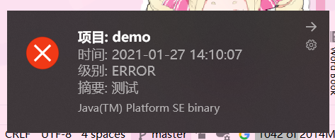

# log4j2-p2p

项目的主要目的是开发一个client-server之间的点对点日志推送模式, 主要用于测试用途

## 目前客户端的展示暂未开发主窗口, 在windows下的展示效果如下



## log4j2的使用方式

配置服务器端的log4j2.xml, 以下配置为例

```xml
<?xml version="1.0" encoding="UTF-8" ?>
<!--指定插件的扫描包-->
<configuration packages="zhong.log4j2.server.commpent">
    <Appenders>
        <!-- 输出到控制台 -->
        <Console name="console" target="SYSTEM_OUT">
            <!--输出日志的格式，使用SpringBoot配色（仅能在SpringBoot项目中使用） -->
            <PatternLayout
                    pattern="%d{yyyy-MM-dd HH:mm:ss.SSS} %pid %t %p %C %M %L - %m%n"/>
        </Console>
        <!--引入插件-->
        <P2pServerAppender name="P2pServerAppender" project="demo" port="8080">
            <PatternLayout pattern="%d{yyyy-MM-dd HH:mm:ss.SSS} [%t] [%-5p] {%F:%L} - %m%n"/>
        </P2pServerAppender>
    </Appenders>

    <Loggers>
        <root level="debug">
            <AppenderRef ref="console"/>
            <!--使用自定义插件-->
            <AppenderRef ref="P2pServerAppender"/>
        </root>
    </Loggers>
</configuration>
```

**修改客户端的源码: [配置代码文件](log4j2-windows-desktop-client/src/main/java/zhong/log4j2/p2p/windows/client/config/Config.java)**

```java
package zhong.log4j2.p2p.windows.client.config;

/**
 * 基础配置
 *
 * @author aszswaz
 * @date 2021-01-27 星期三 10:08
 */
public class Config {
    /**
     * 服务器配置
     */
    public static final String SERVER_HOST = "localhost";
    public static final int SERVER_PORT = 8080;
}
```

**修改服务器域名或IP地址, 以及连接的端口号**

**客户端的启动类: zhong.log4j2.p2p.windows.client.LogP2pWindowsClient**

### maven打包指令

**客户端与服务端**

```bash
$ mvn clean package -Dmaven.test.skip=true 
```

### 客户端jar包运行

```bash
$ java -jar target/log4j2-p2p-windows-client-jar-with-dependencies.jar
```